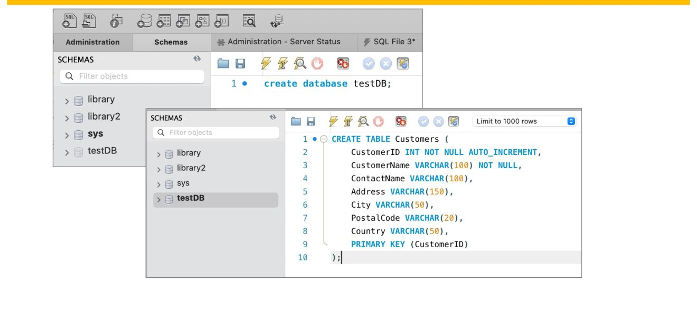
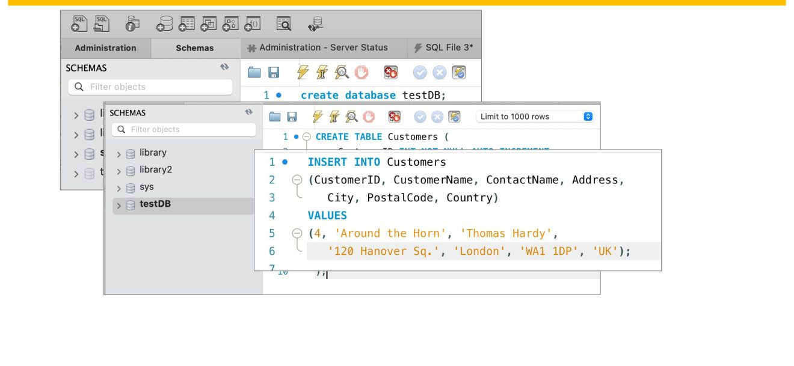
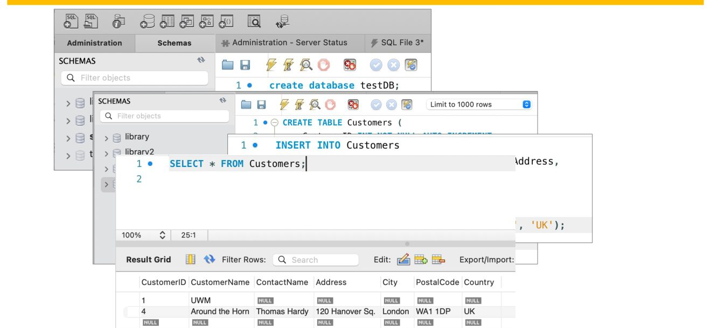

# 🔁 04 · Forms & Querying

🎞️ Four episodes in, and the shop answers back.

Ask Doc for a tour!
{: .avatar_trigger target="guide" }

You have asked the database questions, built its tables, and drawn its
model. This is the **activity page**: the whole story in one walk, with
the tool in your hands. Nothing new to install — everything here you
have already met, once.

**The promise:** by the end of this page you can say what each move was
*for* — the question, the filter, the link between tables, the two ways
to look at an answer — and you can prove it on a quiz you take as many
times as you like.

- [🧱 The Moon Walk](../module_03/01_moon_walk.md)
- [📐 Good Design](../module_03/02_design.md)
{: .prerequisite }

````
### 🏆 1 · From story to structure

It began with a quest: **Thomas Hardy**, a customer in London, places
the first order for cranberry sauce after Labor Day — six hours ahead
of Milwaukee. You said it in plain English first. Then you said it in
SQL.

[The quest, on paper](_slides/m04_02.jpg)
{: .embed image="true" width="100%" }

That order matters more than the syntax. **A query is not syntax
first, it is structured reasoning first.** Ask the question badly and
no keyword will save the answer.
````
{: .accordion #quest }

````
### 🎯 2 · Ask precisely — the filter

Scrolling finds a customer the way a shelf finds a book: eventually.
The `where`[^where] clause asks instead.

[SELECT some rows based on criteria](_slides/m04_03.jpg)
{: .embed image="true" width="100%" }

*English: select the London customers.* Then, precisely:

~~~sql
SELECT * FROM Customers WHERE City = 'London';
~~~

**WHERE introduces a condition. It filters rows. It turns logic into
computation.** Every row is tested; only the ones that pass come back.
````
{: .accordion #filter }

**Q:** Six London customers come back out of ninety-one. What did
WHERE actually do?

- [ ] It sorted the table so the London rows came first

  > Sorting changes the order of everything and hides nothing. The
  > other eighty-five rows did not come back at all.

- [x] It tested every row and kept only those that passed

  > A condition, evaluated row by row. Logic turned into computation
  > — which is why the count drops instead of the order changing.

- [ ] It searched the City column for text that looks like London

  > Close, but looser than the truth: `=` is exact. "London" with a
  > space, or "london" on some servers, is a different value.
{: .quiz }

````
### 🔗 3 · Two tables, one answer — and the answer is a table

Then you asked for facts that live apart: products, and the category
each one belongs to. You matched a **primary key** with the **foreign
key** that references it — and the word JOIN was nowhere in sight: a
comma between the two tables, and the match written in the WHERE. Two
tables, related rows, no keyword.

[SELECT rows from 2 tables](_slides/m04_04.jpg)
{: .embed image="true" width="100%" }

The same relationship, written the long way:

~~~sql
SELECT Orders.OrderID, Customers.CustomerName
FROM Orders
INNER JOIN Customers ON Orders.CustomerID = Customers.CustomerID;
~~~

And the sentence it enforces: *a customer may place zero, one, or many
orders; each order belongs to exactly one customer.*

**Two spellings, one question.** So far the link has been implicit: a
comma, and the match buried among the filters. There is a second way to
say exactly the same thing, out loud:

~~~sql
-- the comma, with the link hidden in the WHERE
SELECT ProductName, CategoryName, Price
FROM Products, Categories
WHERE Products.CategoryID = Categories.CategoryID;

-- the same question, with the link where it belongs
SELECT ProductName, CategoryName, Price
FROM Products JOIN Categories
  ON Products.CategoryID = Categories.CategoryID;
~~~

Same rows, same count. The second reads better, and it is safer:

- **The link sits with the tables it links.** `FROM … JOIN … ON` says in
  one breath which tables meet and on what. The WHERE is then free for
  what it is actually for — filtering rows.
- **Forgetting is loud instead of silent.** Drop the ON and the database
  refuses the sentence. Drop the WHERE from the comma version and it
  runs happily, handing you every pair — a cross product wearing the
  costume of an answer.
- **It says what you meant.** A reader — and a query planner — sees a
  join declared, not a filter that happens to mention two keys.

**The result looks like a table — because it is one.** Data stays
normalized in its own tables; the query recombines it on demand. And a
result that is a table can be used in another select.
````
{: .accordion #join }

````
### 🖥️ 4 · The Workbench loop

Three moves, always the same three, and Workbench replays them every
time you open it:

- 
- 
- 
{: .carousel }

Create the database. Create the table in it. Put a row in, then select
to see what the server actually stored. The client asks, the server
answers — even when both live on your laptop.
````
{: .accordion #workbench }

````
### 📊 5 · From grids to forms

`SELECT * FROM Customers;` gives you a **grid**[^grid]: rows and
columns, everything side by side. Press **Form Editor** and the same
rows arrive one at a time, as a `form`[^form] — with an Apply button
that commits your edit.

[From Grids to Forms](_slides/m04_09.jpg)
{: .embed image="true" width="100%" }

A grid emphasizes **comparison**. A form emphasizes **inspection and
modification**. Most real applications carry both — and so does this
page: click a row above and watch the card below follow it.
````
{: .accordion #grids_forms }

````
### 🔎 The shop, live — filter, join, grid and form

```json
[
  {"CustomerID": 1, "CustomerName": "Alfreds Futterkiste", "ContactName": "Maria Anders", "City": "Berlin", "Country": "Germany"},
  {"CustomerID": 4, "CustomerName": "Around the Horn", "ContactName": "Thomas Hardy", "City": "London", "Country": "UK"},
  {"CustomerID": 11, "CustomerName": "B's Beverages", "ContactName": "Victoria Ashworth", "City": "London", "Country": "UK"},
  {"CustomerID": 34, "CustomerName": "Hanari Carnes", "ContactName": "Mario Pontes", "City": "Rio de Janeiro", "Country": "Brazil"},
  {"CustomerID": 90, "CustomerName": "Wilman Kala", "ContactName": "Matti Karttunen", "City": "Helsinki", "Country": "Finland"}
]
```
{: .dataset #Customers }

**The filter.** Edit the city, press ▶ Run, and watch the count move:

```sql
SELECT * FROM Customers WHERE City = 'London'
```
{: .query source="Customers" #q_london editable="true" }

[the grid — comparison](#)
{: .datagrid #london_grid source="q_london" rows="2" }

**The form.** The same rows, one at a time — pick a line above:

```yaml
```
{: .form bound="london_grid" title="Customer" }

**The join.** Products and their categories, two tables, one result:

```json
[
  {"ProductID": 1, "ProductName": "Chais", "CategoryID": 1, "Price": 18},
  {"ProductID": 24, "ProductName": "Guaraná Fantástica", "CategoryID": 1, "Price": 4.5},
  {"ProductID": 57, "ProductName": "Ravioli Angelo", "CategoryID": 5, "Price": 19.5},
  {"ProductID": 65, "ProductName": "Louisiana Fiery Hot Pepper Sauce", "CategoryID": 2, "Price": 21.05}
]
```
{: .dataset #Products }

```json
[
  {"CategoryID": 1, "CategoryName": "Beverages"},
  {"CategoryID": 2, "CategoryName": "Condiments"},
  {"CategoryID": 5, "CategoryName": "Grains/Cereals"}
]
```
{: .dataset #Categories }

```sql
SELECT ProductName, CategoryName, Price
FROM Products, Categories
WHERE Products.CategoryID = Categories.CategoryID
```
{: .query source="Products,Categories" #q_join editable="true" }

[each product with its category](#)
{: .datagrid source="q_join" rows="4" }

Drop the WHERE line and run it again: four products times three
categories, twelve lines of nonsense. Put it back. The key equality is
the whole difference between a cross product and an answer.

**Your move.** The query above ships the old way: a comma, and the link
hidden in the WHERE. Rewrite it — `FROM Products JOIN Categories ON
Products.CategoryID = Categories.CategoryID` — and press ▶ Run. The
answer must not move: same four rows, same three columns.

The second check at the bottom of this page is **red until you do it**.
Nothing here grades you; the green is yours to earn, by your own hand.
````
{: .block title="🔎 The shop, live" #live }

**Q:** The grid and the form on this page show different things. What
is actually different?

- [x] Only the view — both read the same rows from the same query

  > One query, two windows on it. A grid lines the rows up for
  > comparison; a form gives one row room to be read and edited.

- [ ] The form holds a copy, so editing it cannot affect the grid

  > They are bound: the form follows the grid's selection. A copy
  > that drifts is exactly what binding exists to prevent.

- [ ] The grid comes from the table and the form from the query

  > Both come from the query result. In Workbench too: Result Grid
  > and Form Editor are two faces of one result set.
{: .quiz }

```
### ✅ Your move

Calibration, not examination: take the
[w3schools SQL quiz](https://www.w3schools.com/sql/sql_quiz.asp) as
many times as you want. Keep a screenshot of your **best score**, and
write one line about the topic that fought back hardest.

You do not need 100%. The point is to learn what you control and what
still needs rehearsal. The tutorial sections worth a second pass:
ORDER BY, GROUP BY, UPDATE, ALTER, wildcards, and creating or altering
a database.

**This week's focus:** databases are about precision. Queries are
structured questions; grids and forms are structured views of the
answers. Refine how you ask. Refine how you read.
```
{: .accordion #your_move }

Four words to keep from this page: `where`[^where] filters rows,
`join`[^join] matches a key to the key that references it, a
`grid`[^grid] compares rows and a `form`[^form] inspects one. The proof
below runs the page's own two queries:

```gherkin
Feature: The filter narrows, the join recombines
  Scenario: WHERE keeps only the rows that pass
    Given the customers slice and the London filter
    :::python
    self.all: Dataset = Dataset("Customers")
    self.london: Query = self.page.q_london
    :::
    Then two of the five customers come back, both in London
    :::python
    assert self.all.count == 5, self.all.count
    assert self.london.count == 2, self.london.count
    cities: list[str] = self.london.values("City")
    assert cities == ["London", "London"], cities
    :::

  Scenario: Two tables, related rows — never every pair
    Given the products, the categories and the query over both
    :::python
    self.products: Dataset = Dataset("Products")
    self.categories: Dataset = Dataset("Categories")
    self.joined: Query = self.page.q_join
    :::
    Then the result carries one line per product, not every pair
    :::python
    assert self.joined.count == self.products.count, self.joined.count
    assert self.joined.count != self.products.count * self.categories.count
    names: list[str] = self.joined.values("CategoryName")
    assert "Beverages" in names, names
    :::

```
{: .feature #activity_proof tags="where, join, grid, form" visible="true" status="passing" }

And one check that is **yours**. It reads the join in the shop app above
and stays red while that query still links its tables with a comma and a
WHERE. Rewrite it as `FROM Products JOIN Categories ON …`, press ▶ Run
up there, then press ▶ Run here:

```gherkin
Feature: Your move — the WHERE, rewritten as a join
  Scenario: The shop app links its tables with JOIN … ON
    Given the join in the shop app
    :::python
    self.shop: Query = self.page.q_join
    self.products: Dataset = Dataset("Products")
    :::
    Then it says JOIN … ON, not a comma and a WHERE
    :::python
    flat: str = " ".join(self.shop.query.upper().split())
    assert "JOIN" in flat and " ON " in flat, \
        "still a comma and a WHERE — rewrite the query above, press Run, then run this check"
    assert "WHERE" not in flat, \
        "the link lives in ON now, so the WHERE can go"
    :::
    And the answer did not move — one line per product
    :::python
    assert self.shop.count == self.products.count, self.shop.count
    names: list[str] = self.shop.values("ProductName")
    assert "Chais" in names, names
    :::
```
{: .feature #your_move_proof tags="join" visible="true" status="pending" celebration="true" }

[Browse](#)
{: .folder parent="true" }

```yaml
bot: doc
voice: en-US
face:
  zoom: 1.2
script:
  - say: "Four episodes in. A jar of cranberry sauce, a customer in London, and a question nobody could answer by scrolling. Let me tell you the whole story, in one walk."
  - at: quest
    do: open
    say: "It began as a quest. Thomas Hardy, London, the first cranberry sauce order after Labor Day. You said it in English first, then in SQL — and that order matters more than the syntax. A query is structured reasoning before it is anything else."
  - at: filter
    do: open
    say: "Then you stopped scrolling and started asking. WHERE introduces a condition; it tests every row and keeps the ones that pass. Logic, turned into computation."
  - at: join
    do: open
    say: "Next, facts that live apart: a product here, its category there. You matched a primary key with the foreign key that points at it — with a comma and a WHERE, no keyword in sight — and the result looked like a table, because it is one. Data stays in its own tables; the query recombines it when you ask."
  - at: workbench
    do: open
    say: "Three moves, always the same three. Create the database, create the table, insert a row and select it back. The client asks, the server answers — even when both live on your laptop."
  - at: grids_forms
    do: open
    say: "And one answer, two windows. A grid puts the rows side by side for comparing. A form gives one row room to be read and changed, with Apply to commit it. Real applications carry both."
  - at: live
    do: open
    say: "Here is the shop, live. Change the city in the filter and watch the count move. Click a row and the card below follows it. Then your move: rewrite the join the other way — FROM Products JOIN Categories ON — and press Run. The last check on this page is red until you do, and the answer must not budge."
  - at: your_move
    do: open
    say: "Your move is calibration, not examination: the w three schools SQL quiz, as often as you like. Keep your best score and name the topic that fought back hardest. Precision is the whole craft — refine how you ask, refine how you read."
stories:
  summarize the page:
    - 'You might wonder: summarize the page'
    - This page retells the whole story so far, with the tool in your hands.
    - It began as a quest about Thomas Hardy in London, said in English first and then in SQL.
    - WHERE filters rows by testing each one; a join matches a primary key with the foreign key that references it.
    - Related rows from two tables can be fetched with a comma and a WHERE, or with FROM JOIN ON, which keeps the link beside the tables it links.
    - The result of a join is itself a table, so it can be used in another query.
    - Workbench always does the same three moves — create the database, create the table, insert and select back.
    - A grid compares rows side by side; a form shows one row at a time and lets you edit it.
  what is the difference between a grid and a form:
    - 'You might wonder: what is the difference between a grid and a form'
    - They are two views of the same rows, not two sets of data.
    - A grid lines the rows up in columns, which is what you want for comparing.
    - A form gives one row at a time, with editable fields and an Apply button, which is what you want for inspecting and changing.
  why not just scroll:
    - 'You might wonder: why not just scroll'
    - Scrolling works on five rows and fails on ninety-one, or on a million.
    - A query asks the question precisely, and the database does the walking.
    - WHERE tests every row against your condition and returns only the ones that pass.
```
{: .avatar #guide dock="true" size="115" }

[^where]: **where** — the clause that keeps only the rows passing a
    test, such as `City = 'London'`. It filters rows; it never picks
    columns.
[^join]: **join** — bringing related rows from two tables into one
    result by matching a primary key with the foreign key that
    references it. The match can be written two ways: a comma in the
    FROM with the match in the WHERE — no keyword at all — or
    `FROM a JOIN b ON …`, which says it in the open.
[^grid]: **grid** — rows and columns side by side, the view for
    comparing records. Workbench calls it the Result Grid.
[^form]: **form** — one record at a time, with editable fields and an
    Apply button. Workbench calls it the Form Editor.
