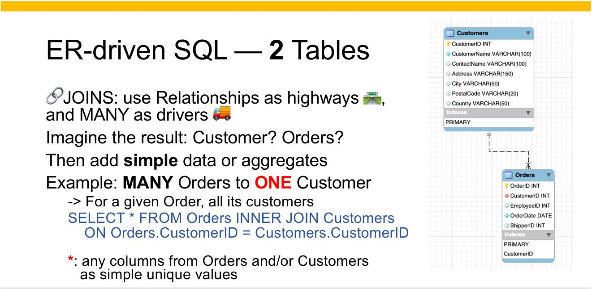
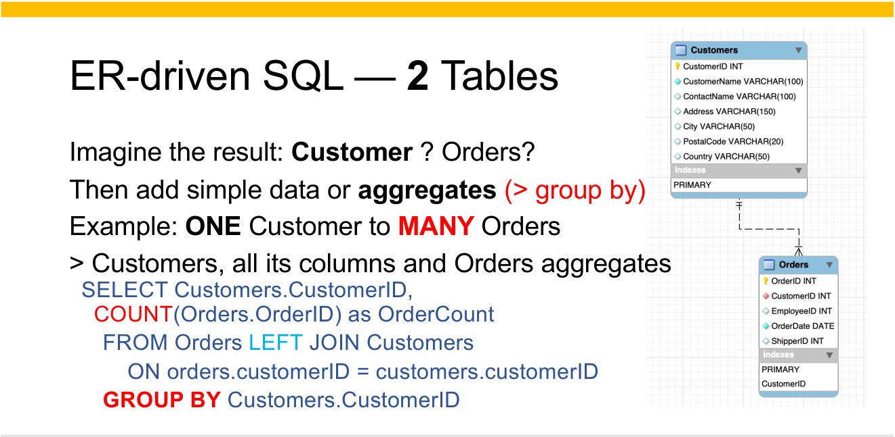
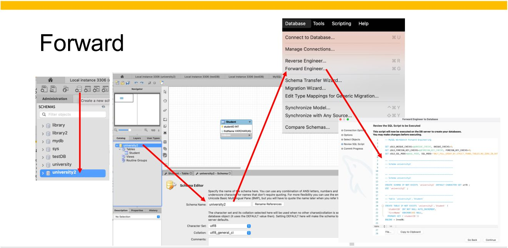
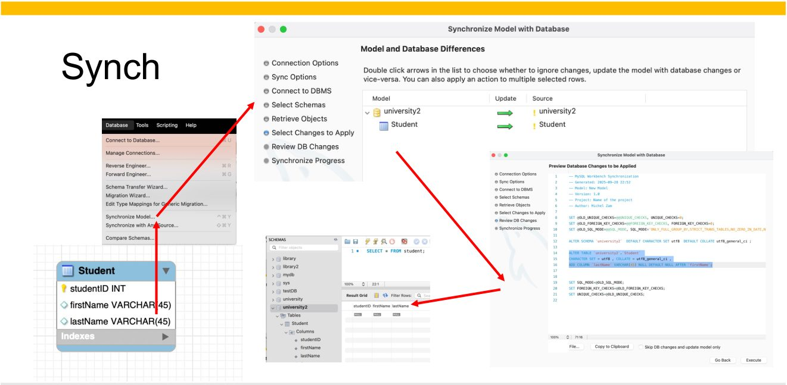

# 🧭 05 · ER-driven Queries

🗺️ This week, the map on the wall becomes your GPS.

Ask Doc for a tour!
{: .avatar_trigger target="guide" }

Welcome back! This week has **one big idea**: before you type a query,
look at the map. The map tells you which tables you need and how they
connect — so you never have to guess.

We go **one small step at a time**: first one table, then two, then
three. Each step is short, and each one ends with a little quiz. The quiz
is just for you — it checks that you got the step before you move on. No
step takes more than a few minutes. Deal? 🤝

> Why did the database break up with the spreadsheet?
> It needed a relationship with more *keys*.

````
### 🧠 Step 1 · Think slow first

Your brain has two ways of thinking. A psychologist, Daniel Kahneman,
called them **System 1** and **System 2**. Watch this short video first:

[▶️ Thinking, Fast and Slow — System 1 and System 2](https://youtu.be/PirFrDVRBo4)
{: .video #fast_slow height="360" }

In plain words:

- **System 1 is fast.** It answers right away, without effort — like
  knowing 2 + 2 = 4, or reading a face. It is great most of the time…
  and sometimes confidently wrong.
- **System 2 is slow.** It checks, step by step, with effort — like
  solving 17 × 24. It is tiring, so your brain uses it only when it has
  to.

[Fast vs slow thinking](_slides/m05_02.jpg)
{: .embed image="true" width="100%" }

**When we query or design a database, we need System 2.** SQL runs
whatever you type, and a query written on autopilot often still *runs* —
it just answers a different question. Remember module 02: 616 rows of
products paired with every category looked like an answer, and it was
nonsense.

The good news: System 2 does not mean slow typing. It means **checking**.
The SQL editor answers in a second, so you can work in small steps: run
a small query, look at the result, change one thing, run it again. Each
look at the result is System 2 at work — and every result teaches you
something.

**Q:** Try it with your fast brain first. A bat and a ball cost $1.10
together. The bat costs $1.00 more than the ball. How much does the ball
cost?

- [ ] Nothing — the bat stole the ball and ran off into the night with it

  > Tempting, but the bat is innocent. Ball $0.05, bat $1.05 — System 2
  > checked.

- [ ] 10 cents

  > That is the answer almost everyone's System 1 gives. Check it: the
  > bat would cost $1.10, and together $1.20 — too much. Fast, and wrong.

- [x] 5 cents

  > Ball $0.05, bat $1.05: together $1.10, and the bat costs exactly
  > $1.00 more. You needed a second look to find it. That second look is
  > System 2.

- [ ] There is not enough information to know

  > There is: two facts, one unknown. Slow down and the answer comes out.
{: .quiz }

**Q:** In this class, which are good ways to work toward a query? Check
all that apply.

- [ ] Close your eyes, whisper SELECT three times, and let the database guess what you meant

  > Databases are great listeners and terrible mind readers. Tell them
  > exactly what you want.

- [x] Type SELECT * and change things until the grid looks right

  > A great way to learn! The editor gives instant feedback, so you
  > build the query one small step at a time — and each look at the grid
  > is System 2 checking your work.

- [ ] Paste a query from an AI without reading it

  > Fast, and nobody checked it. An AI often uses column names that are
  > not even in our database — and you learn nothing from pasting.

- [x] Say it in English, then find its tables and keys on the map

  > Slow first, then fast. The map shows where each word of your
  > question lives and which key connects them.
{: .quiz multi="true" }

````
{: .accordion #think_slow }


````
### 🏛️ Step 2 · Two pillars: storing and using

[Two data pillars](_slides/m05_03.jpg)
{: .embed image="true" width="100%" }

Every database stands on two pillars:

- **Representation** — *how the data is stored.* That is what you built
  in module 03 with CREATE TABLE: the tables, their columns, their keys.
- **Usage** — *how the data is used.* That is what you do with SELECT.

The two are tied together. The tables you created are the only roads
your SELECT can take. A good design makes good questions easy.

One more rule, called the **closed world**: *what the database does not
know is considered false.* If no row says it happened, then — for the
database — it did not happen.

**Q:** Wilman Kala placed one order in our shop, and none of its lines
is Tofu. Someone asks the database: "Did Wilman Kala order Tofu?" What
does the database answer?

- [ ] It asks Wilman Kala directly, by carrier pigeon, and waits for the reply

  > The database only asks itself. What it does not store, it treats as false.

- [ ] "Maybe" — it cannot know for sure

  > A database does not do "maybe". Under the closed world, what is not
  > stored counts as false.

- [x] "No" — what is not stored counts as false

  > That is the closed world. No line says Wilman Kala bought Tofu, so
  > the answer is no.

- [ ] It shows an error message

  > No error at all: the query simply finds no matching row, and zero
  > rows means "no".
{: .quiz }

````
{: .accordion #pillars }


````
### 1️⃣ Step 3 · One table

[ER-driven SQL — one table](_slides/m05_04.jpg)
{: .embed image="true" width="100%" }

Let's start small: **one table**, Customers. You already know most of
this — here it is in three little moves.

**a) Pick columns and rows.** SELECT picks the columns, WHERE picks the
rows:

~~~sql
SELECT Customers.ContactName, Customers.City
FROM Customers
WHERE Customers.Country = 'Brazil';
~~~

**b) One number for the whole table.** An *aggregate* — COUNT, MIN,
MAX, SUM, AVG — folds many rows into one number:

~~~sql
SELECT COUNT(*) FROM Customers;
~~~

**c) One number per group.** GROUP BY first sorts the rows into groups
(one group per country, say), then the aggregate gives one number per
group:

~~~sql
SELECT Customers.Country, COUNT(*) AS HowMany
FROM Customers
GROUP BY Customers.Country;
~~~

**The one rule of `group_by`[^group_by].** With GROUP BY, the SELECT
may contain only:

1. the **GROUP BY fields** — here `Customers.Country`;
2. **aggregates** — here `COUNT(*)`.

Nothing else. Why? Each group becomes **one row**. A group field has
one value per group, so it fits. Any other column may have several
values in the same group — and one row cannot show several values.

Think of GROUP BY as a party with a strict guest list: the group fields
get in by name, everyone else only as a COUNT. 🎉

👉 Try it: **①** in the practice block at the bottom of the page.

**Q:** `SELECT Customers.Country, COUNT(*) FROM Customers GROUP BY
Customers.Country` gives one row per country. Can you add
`Customers.City` to the SELECT?

- [ ] Yes, as long as Brazil promises to pick its favorite city first, and never changes its mind

  > Brazil loves both cities equally. The rule decides instead: group fields and aggregates only.

- [ ] Yes, any column of the table can go in the SELECT

  > Not with GROUP BY. In our shop, Brazil has two cities — Rio de
  > Janeiro and São Paulo. Brazil gets one row: which city would it show?

- [x] No: Brazil holds Rio and São Paulo, and one row fits one city

  > Exactly the rule: only GROUP BY fields and aggregates. City is
  > neither, and Brazil shows why.

- [ ] Only if you also add ORDER BY Customers.City

  > Sorting puts rows in order; it does not choose one city for a group.
{: .quiz }

````
{: .accordion #one_table }


````
### 2️⃣ Step 4 · Two tables: one row per order

- 
{: .carousel }

Now **two tables**: Orders and Customers. Look at them in the practice
block: each order has a `CustomerID` column. That column is a **foreign
key** — it holds the ID of the customer who placed the order.

A JOIN lines up each order with its customer, by matching the two IDs:

~~~sql
SELECT Orders.OrderID, Customers.CustomerName
FROM Orders
JOIN Customers ON Orders.CustomerID = Customers.CustomerID;
~~~

The slides say: **relationships are highways, and MANY is the driver.**
One customer can have *many* orders; each order has *one* customer. The
MANY side — Orders — drives: you get **one row per order**, each one
carrying its customer's name.

Before you type, always ask: *one row per what?* Here: one row per order.

👉 Try it: **②** in the practice block.

**Q:** In our shop, Orders is joined to Customers on their ID. How many
rows come back?

- [ ] Zero — customers are shy, so they hide behind their orders and refuse to come out

  > Our customers are very outgoing: each of the four orders brings its customer along.

- [ ] Three — one per customer, Hanari Carnes appearing once

  > One row per customer needs GROUP BY — that is the next step. A plain
  > join keeps every order.

- [x] Four — one per order, Hanari Carnes appearing twice

  > Orders drives. Each of the four orders finds its customer. Hanari
  > Carnes placed two orders, so its name shows up twice.

- [ ] Twelve — every order paired with every customer

  > That is what you get with no ON at all: 4 × 3 pairs. The ON keeps
  > only the pairs that belong together.
{: .quiz }

````
{: .accordion #two_tables }


````
### 2️⃣ Step 5 · Two tables: one row per customer

- 
{: .carousel }

Same two tables, a different question: **how many orders did each
customer place?** Now we want *one row per customer*.

A customer's orders are several rows, so we fold them — with GROUP BY on
the customer and COUNT on the orders:

~~~sql
SELECT Customers.CustomerName, COUNT(Orders.OrderID) AS OrderCount
FROM Orders
JOIN Customers ON Orders.CustomerID = Customers.CustomerID
GROUP BY Customers.CustomerID, Customers.CustomerName;
~~~

Check the guest list: `Customers.CustomerName` is in the SELECT, so it
is in the GROUP BY too. `COUNT(Orders.OrderID)` is an aggregate, so it
may come in.

Same highway, other direction, other answer. That is why you decide
*one row per what?* **before** typing.

👉 This one is **your move** — at the bottom of the page.

**Q:** After GROUP BY the customer, Hanari Carnes appears only once,
with OrderCount 2. What happened to its two orders?

- [ ] A hungry GROUP BY ate the second order because it skipped breakfast this morning

  > GROUP BY eats nothing. The two orders are folded into one group, and COUNT says 2.

- [ ] GROUP BY deleted the second order

  > Nothing is deleted. The Orders table still holds both orders; the
  > result just folds them together.

- [x] They fell into the same group, and COUNT turned them into the number 2

  > One group per customer. Hanari Carnes' group holds two orders, and
  > COUNT says how many rows are in it.

- [ ] Hanari Carnes had only one order to begin with

  > It has two: orders 10250 and 10253. Look for CustomerID 34 in the
  > Orders table.
{: .quiz }

````
{: .accordion #per_customer }


````
### 🗺️ Step 6 · Three tables: the map and its compass

Two tables went well. Now look at the whole map — the dataquest map
you have used since week one:

[The dataquest map — eight tables](_slides/dataquest_map.jpg)
{: .embed image="true" width="100%" }

The map is drawn with one rule: **the ONE side is always above the MANY
side.** Customers is above Orders (one customer, many orders). Orders
is above OrderDetails (one order, many lines). Products is above
OrderDetails too.

So every foreign key points **up** — to the `north`[^north]. That gives
you a compass:

- **Going north is safe.** Each order line finds exactly *one* product;
  each product finds exactly *one* category. You collect names, and the
  number of rows **does not change**.
- **Going south multiplies.** One order has many lines. Come back with
  an aggregate (COUNT, SUM) and a GROUP BY.

Here are three tables, all going north from the order lines:

~~~sql
SELECT OrderDetails.OrderID, Products.ProductName,
       Categories.CategoryName
FROM OrderDetails
JOIN Products ON OrderDetails.ProductID = Products.ProductID
JOIN Categories ON Products.CategoryID = Categories.CategoryID;
~~~

**One habit to keep:** write the table name before every column —
`Products.ProductName`, not just `ProductName`. The map tells you which
table owns each column, and our practice app needs it when three tables
meet.

👉 Try it: **③** in the practice block.

**Q:** Our shop has 11 order lines. You start from OrderDetails, then
join Products, then Categories. How many rows come back?

- [ ] So many rows that the grid gives up, orders a pizza, and goes home

  > North is calm: each line finds one product and one category. Eleven in, eleven out.

- [ ] 7 — one per category

  > One row per category would need a GROUP BY. A plain join keeps the
  > lines.

- [x] 11 — one per line, each now showing its product and category

  > North is safe: each line finds one product, each product one
  > category. Eleven lines in, eleven rows out.

- [ ] 110 — every line with every product

  > That is the pairing you get with no ON. With ON, each line finds
  > exactly one product.
{: .quiz }

````
{: .accordion #map }


````
### 🧭 Step 7 · Navigations: north for names, south for totals

[Navigations: orders and theirs](_slides/m05_08.jpg)
{: .embed image="true" width="100%" }

With the compass, two kinds of trips:

- **North, for names.** For each order, fetch its customer's
  ContactName, its employee's FirstName, its shipper's ShipperName.
  Three trips north — and still **one row per order**.
- **South, for totals.** For each order, its lines: many per order. So
  we add them up and group by the order:

~~~sql
SELECT Orders.OrderID,
       SUM(Products.Price * OrderDetails.Quantity) AS Revenue
FROM Orders
JOIN OrderDetails ON OrderDetails.OrderID = Orders.OrderID
JOIN Products ON Products.ProductID = OrderDetails.ProductID
GROUP BY Orders.OrderID;
~~~

Read it slowly: each line's amount is its product's *Price* times the
line's *Quantity*. SUM adds the amounts of one order's lines, and GROUP
BY makes one row per order.

👉 See it: **④** in the practice block.

**Q:** Revenue per order: each order has several lines. What turns them
into one number per order?

- [ ] A strongly worded email asking the database to please add things up

  > Politeness is nice, but SUM with GROUP BY Orders.OrderID is what adds each order's lines.

- [ ] ORDER BY Orders.OrderID

  > Sorting keeps every line — it only puts them in order.

- [x] SUM(…) together with GROUP BY Orders.OrderID

  > The lines of one order fall into one group, and SUM adds their
  > amounts. One order, one row, one total.

- [ ] One more JOIN, to Customers

  > Customers is north of Orders: joining it adds names, not totals.
{: .quiz }

````
{: .accordion #navigations }


````
### 🔁 Step 8 · Forward and back in Workbench

- 
- 
{: .carousel }

In MySQL Workbench, the map is also a **blueprint**:

- **Forward Engineer** takes the model you drew and writes the CREATE
  statements that build the real tables.
- **Synchronize Model** compares the model and the database, and applies
  only what changed — in either direction.

Storing and using, CREATE and SELECT: one map for both. (Step 2 said so!)

**Q:** In Workbench, what does Forward Engineer do?

- [ ] It drives your laptop forward, very slowly, across the whole campus, until it reaches your desk

  > Your laptop stays put. Forward Engineer turns your drawing into CREATE statements.

- [ ] It runs your SELECT queries faster

  > It builds the database. Running queries is a different job.

- [x] It turns the model you drew into CREATE statements that build the tables

  > From drawing to database. Draw the map first, and Workbench writes
  > the CREATE statements for you.

- [ ] It draws a model from a database that already exists

  > That is Reverse Engineer — the same bridge, the other direction.
{: .quiz }

````
{: .accordion #forward_back }


````
### 🔎 Practice block — try every step here

The shop's data: a **small slice** of the dataquest — its first four
orders and their lines, straight off the map. Small on purpose: you can
check every answer with your own eyes.

```json
[
  {"CustomerID": 34, "CustomerName": "Hanari Carnes", "ContactName": "Mario Pontes", "City": "Rio de Janeiro", "Country": "Brazil"},
  {"CustomerID": 81, "CustomerName": "Tradição Hipermercados", "ContactName": "Anabela Domingues", "City": "São Paulo", "Country": "Brazil"},
  {"CustomerID": 90, "CustomerName": "Wilman Kala", "ContactName": "Matti Karttunen", "City": "Helsinki", "Country": "Finland"}
]
```
{: .dataset #Customers }

```json
[
  {"OrderID": 10248, "CustomerID": 90, "EmployeeID": 5, "OrderDate": "1996-07-04", "ShipperID": 3},
  {"OrderID": 10249, "CustomerID": 81, "EmployeeID": 6, "OrderDate": "1996-07-05", "ShipperID": 1},
  {"OrderID": 10250, "CustomerID": 34, "EmployeeID": 4, "OrderDate": "1996-07-08", "ShipperID": 2},
  {"OrderID": 10253, "CustomerID": 34, "EmployeeID": 3, "OrderDate": "1996-07-10", "ShipperID": 2}
]
```
{: .dataset #Orders }

```json
[
  {"OrderDetailID": 1, "OrderID": 10248, "ProductID": 11, "Quantity": 12},
  {"OrderDetailID": 2, "OrderID": 10248, "ProductID": 42, "Quantity": 10},
  {"OrderDetailID": 3, "OrderID": 10248, "ProductID": 72, "Quantity": 5},
  {"OrderDetailID": 4, "OrderID": 10249, "ProductID": 14, "Quantity": 9},
  {"OrderDetailID": 5, "OrderID": 10249, "ProductID": 51, "Quantity": 40},
  {"OrderDetailID": 6, "OrderID": 10250, "ProductID": 41, "Quantity": 10},
  {"OrderDetailID": 7, "OrderID": 10250, "ProductID": 51, "Quantity": 35},
  {"OrderDetailID": 8, "OrderID": 10250, "ProductID": 65, "Quantity": 15},
  {"OrderDetailID": 15, "OrderID": 10253, "ProductID": 31, "Quantity": 20},
  {"OrderDetailID": 16, "OrderID": 10253, "ProductID": 39, "Quantity": 42},
  {"OrderDetailID": 17, "OrderID": 10253, "ProductID": 49, "Quantity": 40}
]
```
{: .dataset #OrderDetails }

```json
[
  {"ProductID": 11, "ProductName": "Queso Cabrales", "SupplierID": 5, "CategoryID": 4, "Price": 21},
  {"ProductID": 14, "ProductName": "Tofu", "SupplierID": 6, "CategoryID": 7, "Price": 23.25},
  {"ProductID": 31, "ProductName": "Gorgonzola Telino", "SupplierID": 14, "CategoryID": 4, "Price": 12.5},
  {"ProductID": 39, "ProductName": "Chartreuse verte", "SupplierID": 18, "CategoryID": 1, "Price": 18},
  {"ProductID": 41, "ProductName": "Jack's New England Clam Chowder", "SupplierID": 19, "CategoryID": 8, "Price": 9.65},
  {"ProductID": 42, "ProductName": "Singaporean Hokkien Fried Mee", "SupplierID": 20, "CategoryID": 5, "Price": 14},
  {"ProductID": 49, "ProductName": "Maxilaku", "SupplierID": 23, "CategoryID": 3, "Price": 20},
  {"ProductID": 51, "ProductName": "Manjimup Dried Apples", "SupplierID": 24, "CategoryID": 7, "Price": 53},
  {"ProductID": 65, "ProductName": "Louisiana Fiery Hot Pepper Sauce", "SupplierID": 2, "CategoryID": 2, "Price": 21.05},
  {"ProductID": 72, "ProductName": "Mozzarella di Giovanni", "SupplierID": 14, "CategoryID": 4, "Price": 34.8}
]
```
{: .dataset #Products }

```json
[
  {"CategoryID": 1, "CategoryName": "Beverages"},
  {"CategoryID": 2, "CategoryName": "Condiments"},
  {"CategoryID": 3, "CategoryName": "Confections"},
  {"CategoryID": 4, "CategoryName": "Dairy Products"},
  {"CategoryID": 5, "CategoryName": "Grains/Cereals"},
  {"CategoryID": 7, "CategoryName": "Produce"},
  {"CategoryID": 8, "CategoryName": "Seafood"}
]
```
{: .dataset #Categories }

**① One table** — customers per country. Edit it, press ▶ Run, see what
changes:

```sql
SELECT Customers.Country, COUNT(*) AS HowMany
FROM Customers
GROUP BY Customers.Country
```
{: .query source="Customers" #q_one editable="true" }

[customers per country](#)
{: .datagrid source="q_one" rows="3" }

**② Two tables** — one row per order, with its customer:

```sql
SELECT Orders.OrderID, Customers.CustomerName
FROM Orders
JOIN Customers ON Orders.CustomerID = Customers.CustomerID
```
{: .query source="Orders,Customers" #q_two editable="true" }

[each order with its customer](#)
{: .datagrid source="q_two" rows="4" }

**③ Three tables** — each line going north to its product and category:

```sql
SELECT OrderDetails.OrderID, Products.ProductName,
       Categories.CategoryName
FROM OrderDetails
JOIN Products ON OrderDetails.ProductID = Products.ProductID
JOIN Categories ON Products.CategoryID = Categories.CategoryID
```
{: .query source="OrderDetails,Products,Categories" #q_north editable="true" }

[each line with its names](#)
{: .datagrid source="q_north" rows="4" }

**④ North and south** — revenue per order (just look, for now):

```sql
SELECT Orders.OrderID,
       SUM(Products.Price * OrderDetails.Quantity) AS Revenue
FROM Orders
JOIN OrderDetails ON OrderDetails.OrderID = Orders.OrderID
JOIN Products ON Products.ProductID = OrderDetails.ProductID
GROUP BY Orders.OrderID
```
{: .query source="Orders,OrderDetails,Products" #q_per_order }

[revenue per order](#)
{: .datagrid source="q_per_order" rows="4" }

**✋ Your move** — step 5, by your own hand. This query gives one row
per *order*. Change it so it gives **one row per customer**, with the
number of orders in a column called `OrderCount`:

1. in the SELECT, keep `Customers.CustomerName` and add
   `COUNT(Orders.OrderID) AS OrderCount`;
2. drop `Orders.OrderID` from the SELECT (it is not on the guest list
   any more);
3. add `GROUP BY Customers.CustomerID, Customers.CustomerName` at the end.

Press ▶ Run. You should see three rows, and Hanari Carnes with 2.

```sql
SELECT Orders.OrderID, Customers.CustomerName
FROM Orders
JOIN Customers ON Orders.CustomerID = Customers.CustomerID
```
{: .query source="Orders,Customers" #q_mine editable="true" }

[your answer](#)
{: .datagrid source="q_mine" rows="4" }

The second check at the very bottom stays **red until you do it**.
````
{: .block title="🔎 Practice block" #live }

```
### ✅ The seven quests

Now the real thing, in the w3schools SQL editor, with the dataquest map
next to you. The quests go from easy to hard — take them in order.

1. Highest-priced product — *one table*
2. Top 3 highest-priced products — *one table*
3. Category with most products — *two tables*
4. Suppliers with most categories — *two tables*
5. Customers with most ordered products — *three tables*
6. Top-spending customer — *four tables*
7. Best-selling product and its category — *four tables*

For each quest: say it in English, find the tables on the map, draw the
path, **then** type. Take a snapshot of your query and its result, and
ask a classmate to check it. If quest 7 fights back, that is normal —
it is the boss level. 👾

**Q:** Quest 5 asks for the customers with most ordered products. What
is your very first move?

- [ ] Wait by the phone until a customer calls to say: I ordered the most products, please notice me!

  > Customers rarely call to brag. The map shows the way: Customers, Orders, then the order lines.

- [ ] Type SELECT * FROM Customers and scroll until you see it

  > Scrolling 91 customers is the fast brain's plan — and the grid
  > will not even show you their products.

- [ ] Count each customer's products by hand on paper

  > Counting is the database's job. Your job is to give it the right
  > path.

- [x] Find customers and order lines on the map, and trace the path between them

  > System 2 first: which tables, which keys, one row per what. Then
  > typing takes a minute.
{: .quiz }

```
{: .accordion #quests }


Two words to keep from this week: every foreign key points
`north`[^north], and a `group_by`[^group_by] lets only its own fields
and aggregates into the SELECT. The proof below runs the practice
block's own queries:

```gherkin
Feature: One table, two tables, three tables
  Scenario: One table — one row per country
    Given the customers and the query per country
    :::python
    self.customers: Dataset = Dataset("Customers")
    self.one: Query = self.page.q_one
    :::
    Then each country is one group
    :::python
    countries: set = set(self.customers.values("Country"))
    assert self.one.count == len(countries), self.one.count
    :::

  Scenario: Two tables — one row per order
    Given the orders and the query joining their customers
    :::python
    self.orders: Dataset = Dataset("Orders")
    self.two: Query = self.page.q_two
    :::
    Then there are as many rows as orders
    :::python
    assert self.two.count == self.orders.count, self.two.count
    :::

  Scenario: Three tables — north keeps one row per line
    Given the order lines and the query that climbs north
    :::python
    self.lines: Dataset = Dataset("OrderDetails")
    self.north: Query = self.page.q_north
    :::
    Then there are as many rows as lines, each with its category
    :::python
    assert self.north.count == self.lines.count, self.north.count
    kinds: list[str] = self.north.values("CategoryName")
    assert "Produce" in kinds, kinds
    :::

  Scenario: North and south — one revenue per order
    Given the order lines and the revenue per order
    :::python
    self.lines: Dataset = Dataset("OrderDetails")
    self.per_order: Query = self.page.q_per_order
    :::
    Then each order is one group, with its revenue
    :::python
    order_ids: set = set(self.lines.values("OrderID"))
    assert self.per_order.count == len(order_ids), self.per_order.count
    totals: list[float] = [float(t) for t in self.per_order.values("Revenue")]
    assert 566.0 in totals, totals
    :::
```
{: .feature #activity_proof tags="north, group_by" visible="true" status="passing" }

And one check that is **yours**. It reads your query in the practice
block and stays red while it still gives one row per order:

```gherkin
Feature: Your move — one row per customer
  Scenario: The orders are counted per customer
    Given your query in the practice block
    :::python
    self.mine: Query = self.page.q_mine
    self.orders: Dataset = Dataset("Orders")
    :::
    Then it groups by the customer
    :::python
    flat: str = " ".join(self.mine.query.upper().split())
    assert "GROUP BY" in flat, \
        "no GROUP BY yet — add GROUP BY Customers.CustomerID, Customers.CustomerName, press Run, then run this check"
    group: str = flat.split("GROUP BY")[-1]
    assert "CUSTOMERID" in group, \
        "group by the customer's key: GROUP BY Customers.CustomerID, Customers.CustomerName"
    :::
    And one row per customer, Hanari Carnes with 2 orders
    :::python
    customers: set = set(self.orders.values("CustomerID"))
    assert self.mine.count == len(customers), self.mine.count
    names: list[str] = self.mine.values("CustomerName")
    counts: list[str] = self.mine.values("OrderCount")
    assert "Hanari Carnes" in names, "keep Customers.CustomerName in the SELECT"
    assert counts, "name the count: COUNT(Orders.OrderID) AS OrderCount"
    assert str(counts[names.index("Hanari Carnes")]) == "2", counts
    :::
```
{: .feature #your_move_proof tags="group_by" visible="true" status="pending" celebration="true" }

[Browse](#)
{: .folder parent="true" }

```yaml
bot: doc
voice: en-US
face:
  zoom: 1.2
script:
  - say: "Welcome back! This week has one big idea: before you type a query, look at the map. We go one small step at a time, and every step ends with a little quiz, just for you."
  - at: think_slow
    do: open
    say: "Step one. Your brain has a fast system and a slow system. Watch the short video, then try the bat and ball puzzle. If your first answer was ten cents, congratulations: you have a perfectly normal brain."
  - at: pillars
    do: open
    say: "Step two. Every database stands on two pillars: how the data is stored, and how it is used. And the closed world: what the database does not know counts as false."
  - at: one_table
    do: open
    say: "Step three, one table. Pick columns, pick rows, count them, then count per group. And the one rule of GROUP BY: in the SELECT, only the group fields and aggregates."
  - at: two_tables
    do: open
    say: "Step four, two tables. A join lines up each order with its customer. The MANY side drives, so you get one row per order."
  - at: per_customer
    do: open
    say: "Step five, same two tables, one row per customer. GROUP BY the customer, COUNT the orders. This one is your move, at the bottom of the page."
  - at: map
    do: open
    say: "Step six, three tables. On the map the ONE side is always above the MANY side, so every foreign key points north. Going north is safe: the number of rows does not change."
  - at: navigations
    do: open
    say: "Step seven. North for names, south for totals. Going south, you add things up and group by the order."
  - at: forward_back
    do: open
    say: "Step eight. In Workbench the map is also a blueprint: forward engineer it into tables, and synchronize it when it changes."
  - at: live
    do: open
    say: "Here is the practice block. Try each step's query, change it, press Run. And your move: turn one row per order into one row per customer. The last check stays red until you do."
  - at: quests
    do: open
    say: "Finally, the seven quests, from easy to boss level. Say it in English, find the tables on the map, then type. You've got this."
stories:
  summarize the page:
    - 'You might wonder: summarize the page'
    - This week's big idea is to look at the map before typing a query.
    - Thinking slow first, System 2, avoids queries that run but answer the wrong question.
    - With one table, GROUP BY makes one row per group, and the SELECT may hold only the group fields and aggregates.
    - With two tables, a join matches a foreign key to its key, and the MANY side decides how many rows come back.
    - On the map the ONE side is above the MANY side, so going north keeps the number of rows, and going south needs an aggregate.
    - The practice block lets you run every step, and your move turns one row per order into one row per customer.
  why must every selected column be grouped or aggregated:
    - 'You might wonder: why must every selected column be grouped or aggregated'
    - With GROUP BY, each group becomes one row of the result.
    - A group field has one value per group, so it fits in that row.
    - Another column may have several values in the same group, like two cities for Brazil.
    - One row cannot show several values, so that column must be folded by an aggregate such as COUNT or MAX.
  what is a foreign key:
    - 'You might wonder: what is a foreign key'
    - A foreign key is a column that holds the ID of a row in another table.
    - For example, Orders.CustomerID holds the ID of the customer who placed the order.
    - A join matches the foreign key with that ID, so each order finds its customer.
    - On the map, the foreign key sits in the table below and points up to the table above.
```
{: .avatar #guide dock="true" size="115" }

[^north]: **north** — the direction every foreign key points on the
    map, from the MANY side (below) up to the ONE side (above). Joining
    north is a lookup: one row stays one row, and picks up names.
[^group_by]: **group_by** — sorting rows into groups and making one row
    per group. The SELECT may hold only the GROUP BY fields and
    aggregates such as COUNT, SUM or MAX.
