# Component Model

The typed **coder-side Python API** available in every `.feature` step and
`.button` handler. Reach any named component via `self.page.<id>` — the resolver
returns the matching wrapper below.

This diagram is generated from the wrapper classes themselves (the single source
of truth in `docs/_includes/steps_runtime.md`): each class declares its knobs and
behaviours via `@component(...)` and dumps its own node through an inherited
`to_dot()`. The same code renders **live** through the [`.diagram`](diagram)
component.

```dot
digraph component_model {
  rankdir=BT; nodesep=0.25;
  graph [penwidth=0.1, splines=ortho, fontsize=10, fontname="Source Sans Pro, sans-serif"];
  node [fontname="Source Sans Pro, sans-serif", penwidth=0.3, shape=record, style=filled, color=lightgray, fillcolor=white, fontsize=10];
  edge [fontname="Source Sans Pro, sans-serif", penwidth=0.2, arrowhead=vee, arrowsize=0.8];
  subgraph cluster_pkg_kore {
    label="⚙️ kore"; labeljust=l; fontsize=10; fontcolor="gray40";
    style=filled; fillcolor="gray98"; color="gray85"; margin=16; penwidth=0.3;
    Object [label="{◻️ Object|🔤 id\l}"]
    Page [label="{📄 Page ➭ ◻️|🔤 id\l|▸ feature\l▸ features\l}"]
    Dataset [label="{🛢️ Dataset ➭ ◻️|🔘 loaded\l🔢 count\l}"]
    Bar [label="{▮ Bar ➭ ◻️|🔢 value\l🔤 color\l}"]
    KnowledgeNode [label="{📚 KnowledgeNode ➭ ◻️|🎛️ state\l🔤 title\l🔤 goal\l🔤 use case\l⦙ key concepts\l🔢 karma\l|▹ discover ▹\l▹ design ▹\l▹ specify ▹\l▹ master ▹\l}"]
    Query [label="{🔎 Query|🔤 query\l🔘 editable\l🔘 loaded\l🔢 count\l}"]
  }
  subgraph cluster_pkg_ui {
    label="🎨 ui"; labeljust=l; fontsize=10; fontcolor="gray40";
    style=filled; fillcolor="gray98"; color="gray85"; margin=16; penwidth=0.3;
    Block [label="{🧩 Block ➭ ◻️|🔘 exists\l🔘 visible\l🔤 text\l|▸ click\l▸ has class\l}"]
    Datagrid [label="{▦ Datagrid ➭ 🧩|🔢 row count\l🔤⦙ headers\l📦⦙ rows\l|▸ header\l}"]
    Chart [label="{📈 Chart ➭ 🧩|🔤 type\l🔤 x\l🔤 y\l🔢 bar count\l🔢 point count\l}"]
    Feature [label="{🦄 Feature ➭ 🧩|🔤 title\l🔤 status\l|▸ run\l}"]
    Button [label="{🖱️ Button ➭ 🧩|🔤 text\l🔤 color\l|⚡ on click\l▸ click\l}"]
    Accordion [label="{🪗 Accordion ➭ 🧩|▸ open\l▸ close\l▸ sections\l}"]
    Agent [label="{🤖 Agent ➭ 🧩|🔡 system\l🔤 model\l🔢 temperature\l🔢 max tokens\l🔤 intro\l🔤 placeholder\l|▸ ask\l}"]
    Avatar [label="{🗣️ Avatar ➭ 🧩|🎛️ state\l🔢 size\l🔘 playing\l🔤 speech\l|▹ play ▹\l▹ stop ▹\l}"]
    AvatarTrigger [label="{▶️ AvatarTrigger ➭ 🧩|🔘 playing\l🔤 label\l}"]
    Blocks [label="{🧱 Blocks ➭ 🧩}"]
    Cards [label="{🃏 Cards ➭ 🧩|🔤 cols\l🔢 gap\l}"]
    Carousel [label="{🎠 Carousel ➭ 🧩|🔢 delay\l|▸ next\l▸ prev\l▸ goto\l}"]
    Code [label="{📄 Code ➭ 🧩|🔤 path\l🔤 src\l🔤 lang\l🔤 title\l🔤 repo\l🔤 branch\l}"]
    Dropdown [label="{🔽 Dropdown ➭ 🧩|🔤 label\l|▸ open\l▸ close\l}"]
    EmbedPage [label="{🖼️ EmbedPage ➭ 🧩|🔢 height\l}"]
    Folder [label="{📁 Folder ➭ 🧩|🔤 cols\l🔘 show private\l}"]
    Form [label="{📝 Form ➭ 🧩|🔤 title\l🔤 format\l🔘 editable\l|▸ submit\l}"]
    Grid [label="{▤ Grid ➭ 🧩|🔤 cols\l🔢 gap\l🔤 headings\l}"]
    Map [label="{🗺️ Map ➭ 🧩|🔢 lat\l🔢 lng\l🔢 zoom\l🔢 height\l|▸ pan to\l▸ set zoom\l}"]
    Mdpad [label="{✍️ Mdpad ➭ 🧩|🔢 rows\l}"]
    Menu [label="{🍔 Menu ➭ 🧩|▸ items\l}"]
    ModelCheck [label="{🧪 ModelCheck ➭ 🧩|🔢 checked\l🔢 broken\l🔘 ok\l}"]
    Pytutor [label="{🔬 Pytutor ➭ 🧩|🔢 height\l🔤 bound to\l}"]
    Qr [label="{🔳 Qr ➭ 🧩|🔢 size\l}"]
    Quiz [label="{❓ Quiz ➭ 🧩|🎛️ state\l🔘 multi\l🔘 graded\l|▹ check ▹\l}"]
    Radio [label="{📻 Radio ➭ 🧩|🔤 selected\l|▸ select\l}"]
    Recorder [label="{🎥 Recorder ➭ 🧩|🎛️ state\l🔤 pip\l🔢 size\l🔢 zoom\l🔢 fps\l|▹ start ▹\l▹ stop ▹\l}"]
    Repl [label="{⌨️ Repl ➭ 🧩}"]
    Run [label="{🐍 Run ➭ 🧩|🔢 rows\l🔘 folded\l🔘 silent\l🔡 init\l🔤 bound\l🔤 expected\l|▸ run\l}"]
    Scene3d [label="{🧊 Scene3d ➭ 🧩|🔢 height\l🔘 loaded\l🔤 last log\l|▸ bark\l▸ run\l▸ wag tail\l▸ swim\l▸ blow bubble\l}"]
    Scrollable [label="{📜 Scrollable ➭ 🧩|🔢 height\l}"]
    Slides [label="{🎞️ Slides ➭ 🧩|🔢 current\l|▸ next\l▸ prev\l▸ goto\l}"]
    Stat [label="{🏷️ Stat ➭ 🧩|🔤 value\l}"]
    Tabs [label="{📑 Tabs ➭ 🧩|🔢 active\l|▸ select\l}"]
    Text [label="{🔤 Text ➭ 🧩}"]
    Video [label="{🎬 Video ➭ 🧩|🔢 height\l}"]
    Vitals [label="{📊 Vitals ➭ 🧩|🔢 samples\l🔢 heap mb\l🔢 dom nodes\l}"]
  }
  Block -> Page [color=blue, fontcolor=blue, weight=8, labeldistance=2, headlabel="page", fontsize=8]
  Datagrid -> Dataset [color=blue, fontcolor=blue, weight=8, labeldistance=2, headlabel="bind", fontsize=8]
  Chart -> Dataset [color=blue, fontcolor=blue, weight=8, labeldistance=2, headlabel="bind", fontsize=8]
  Chart -> Datagrid [color=blue, fontcolor=blue, weight=8, labeldistance=2, headlabel="bound to", fontsize=8]
  Chart -> Bar [color=blue, fontcolor=blue, weight=8, labeldistance=2, headlabel="⦙ bars", fontsize=8]
  subgraph cluster_states_Avatar {
    label="🗣️ states 🎛️"; fontsize=10;
    style="filled,rounded"; fillcolor="gray94"; color="gray85"; margin=12; nodesep=0.9;
    node [fontname="Source Sans Pro, sans-serif", shape=record, style="filled,rounded", fillcolor="white", color="gray", fontsize=10, penwidth=0.3]
    edge [style=solid, arrowhead=vee, penwidth=0.2, arrowsize=0.7, fontsize=8]
    st_Avatar_idle [label="➡️ idle"]
    st_Avatar_speaking [label="speaking"]
  }
  st_Avatar_idle -> st_Avatar_speaking [xlabel="play", fontsize=8, color="gray45", fontcolor="gray45", minlen=2, constraint=false]
  st_Avatar_speaking -> st_Avatar_idle [xlabel="stop", fontsize=8, color="gray45", fontcolor="gray45", minlen=2, constraint=false]
  st_Avatar_idle -> Avatar [style=dashed, arrowhead=none, color="gray70"]
  AvatarTrigger -> Avatar [color=blue, fontcolor=blue, weight=8, labeldistance=2, headlabel="target", fontsize=8]
  Form -> Datagrid [color=blue, fontcolor=blue, weight=8, labeldistance=2, headlabel="bound", fontsize=8]
  KnowledgeNode -> KnowledgeNode [color=blue, fontcolor=blue, weight=8, labeldistance=2, headlabel="⦙ prerequisites", fontsize=8]
  KnowledgeNode -> KnowledgeNode [color=blue, fontcolor=blue, weight=8, labeldistance=2, headlabel="⦙ next", fontsize=8]
  KnowledgeNode -> Quiz [color=blue, fontcolor=blue, weight=8, labeldistance=2, headlabel="⦙ quiz", fontsize=8]
  subgraph cluster_states_KnowledgeNode {
    label="📚 states 🎛️"; fontsize=10;
    style="filled,rounded"; fillcolor="gray94"; color="gray85"; margin=12; nodesep=0.9;
    node [fontname="Source Sans Pro, sans-serif", shape=record, style="filled,rounded", fillcolor="white", color="gray", fontsize=10, penwidth=0.3]
    edge [style=solid, arrowhead=vee, penwidth=0.2, arrowsize=0.7, fontsize=8]
    st_KnowledgeNode_locked [label="➡️ locked"]
    st_KnowledgeNode_discovering [label="discovering"]
    st_KnowledgeNode_designing [label="designing"]
    st_KnowledgeNode_specifying [label="specifying"]
    st_KnowledgeNode_mastered [label="mastered"]
  }
  st_KnowledgeNode_locked -> st_KnowledgeNode_discovering [xlabel="discover", fontsize=8, color="gray45", fontcolor="gray45", minlen=2, constraint=false]
  st_KnowledgeNode_discovering -> st_KnowledgeNode_designing [xlabel="design", fontsize=8, color="gray45", fontcolor="gray45", minlen=2, constraint=false]
  st_KnowledgeNode_designing -> st_KnowledgeNode_specifying [xlabel="specify", fontsize=8, color="gray45", fontcolor="gray45", minlen=2, constraint=false]
  st_KnowledgeNode_specifying -> st_KnowledgeNode_mastered [xlabel="master", fontsize=8, color="gray45", fontcolor="gray45", minlen=2, constraint=false]
  st_KnowledgeNode_locked -> KnowledgeNode [style=dashed, arrowhead=none, color="gray70"]
  Query -> Dataset [color=blue, fontcolor=blue, weight=8, labeldistance=2, headlabel="source", fontsize=8]
  subgraph cluster_states_Quiz {
    label="❓ states 🎛️"; fontsize=10;
    style="filled,rounded"; fillcolor="gray94"; color="gray85"; margin=12; nodesep=0.9;
    node [fontname="Source Sans Pro, sans-serif", shape=record, style="filled,rounded", fillcolor="white", color="gray", fontsize=10, penwidth=0.3]
    edge [style=solid, arrowhead=vee, penwidth=0.2, arrowsize=0.7, fontsize=8]
    st_Quiz_pending [label="➡️ pending"]
    st_Quiz_graded [label="graded"]
  }
  st_Quiz_pending -> st_Quiz_graded [xlabel="check", fontsize=8, color="gray45", fontcolor="gray45", minlen=2, constraint=false]
  st_Quiz_pending -> Quiz [style=dashed, arrowhead=none, color="gray70"]
  subgraph cluster_states_Recorder {
    label="🎥 states 🎛️"; fontsize=10;
    style="filled,rounded"; fillcolor="gray94"; color="gray85"; margin=12; nodesep=0.9;
    node [fontname="Source Sans Pro, sans-serif", shape=record, style="filled,rounded", fillcolor="white", color="gray", fontsize=10, penwidth=0.3]
    edge [style=solid, arrowhead=vee, penwidth=0.2, arrowsize=0.7, fontsize=8]
    st_Recorder_idle [label="➡️ idle"]
    st_Recorder_recording [label="recording"]
    st_Recorder_stopped [label="stopped"]
  }
  st_Recorder_idle -> st_Recorder_recording [xlabel="start", fontsize=8, color="gray45", fontcolor="gray45", minlen=2, constraint=false]
  st_Recorder_recording -> st_Recorder_stopped [xlabel="stop", fontsize=8, color="gray45", fontcolor="gray45", minlen=2, constraint=false]
  st_Recorder_idle -> Recorder [style=dashed, arrowhead=none, color="gray70"]
  Query -> Dataset [arrowhead=empty, color=black, penwidth=0.3, constraint=true]
  subgraph cluster_legend {
    style=invis;
    __legend [label="{Legend|🔤 str or 🔡 long str\l🔢 int or float\l🔘 bool\l🕗 datetime\l🔒 password\l🔤 ⦙ list of 🔤\l◻️ Object from kore\l📦 any\l🐟 custom type Fish\l /  derived\l _  private\l =  default value\l⤴️ reflexive reference\l↩️ ⦙ reflexive collection\l ♢ composite or owned\l|⚡️ event or code\l ▸ method\l ▹ conditionnal method\l ▹ with transition ▹\l|🎛️ state machine\l➡️ initial state\l| ➭  inherits from\l|🛄 imported py\l}", style="filled", fillcolor="gray98", color="gray80", fontcolor="#505050", fontsize=10]
  }
}
```

Regenerate with `python tools/gen_component_diagram.py`.
