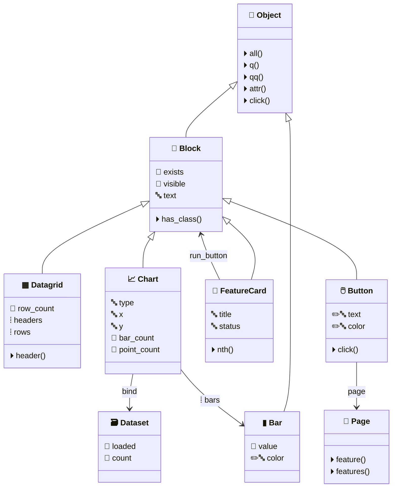

# Component Model

The **coder-side Python API** available in every `.feature` step and `.button` handler.
Reach any component via `self.page.<data-lc-id>` — the page resolver returns a typed wrapper.

## Icon legend

| Icon | Meaning |
|------|---------|
| 🔤 | `str` |
| 🔢 | `int` / `float` |
| 🔘 | `bool` |
| ⦙ | `list` |
| 🔗 | object reference |
| ✏️ | settable (has setter) |
| ⚡️ | event handler |
| ⏵ | method |

All classes live in the steps runtime (`docs/_includes/steps_runtime.md`).
Regenerate this page with `python tools/gen_component_diagram.py`.
