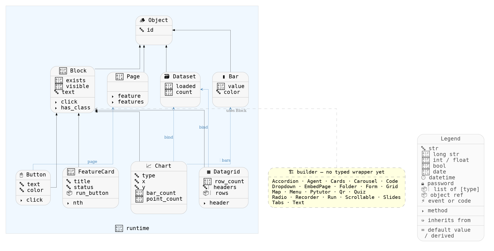

# Component Model

The **coder-side Python API** available in every `.feature` step and `.button` handler.
Reach any named component via `self.page.<id>` — the resolver returns a typed wrapper.

- **runtime** — typed wrapper classes, introspected from `steps_runtime.md`.
- **builder (no typed wrapper yet)** — gallery widgets that fall back to the generic `Block`
  (dashed arrows). This is the live gap report.

Regenerate with `python tools/gen_component_diagram.py`.
