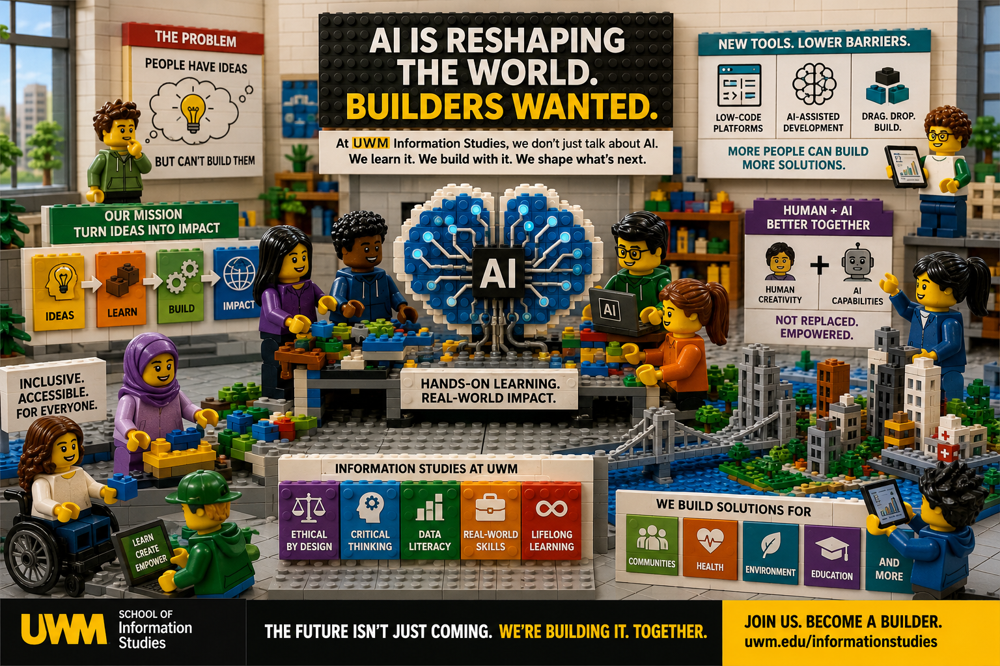

# 🤖 Build-AI

{: .lc-banner }

**AI is reshaping the world — builders wanted.** Build-AI is a private cohort
course where you build a **real AI[^ai] app**, versioned in your own private
bench: graded challenges, answer keys, live sessions, and a teacher who sees
your progress at every step.

```
### 🎯 You want to…
- 👩🏻‍💻 Create your own apps?
- 🤔 Avoid tech hassle?
- 🏗️ Become a builder in the AI era?
- 🪪 Earn your AI builder licence?

### 🥇 This course offers
- a gentle, yet engaging and efficient introduction
- to building apps
- to AI basics
- to best software practices

### 🗺️ The format
- Cohort — onsite or online
- 4, 8 or 15 weeks
- Everything runs in your browser — nothing to install
- Cloud storage for your work, at no additional cost
```
{: .blocks cols="3" }

```
### 👀 What's inside
- Interactive playground 
- Videos and avatars
- Self-guided examples and graded challenges
- Step-by-step directions to do anything
- Building blocks ready to assemble
- Instant help and guidance, any time
- All this in your browser, nothing to install
- A place to grow your skills

### 🤹🏼‍♂️ Skills you'll learn to
- Create web apps for any screen
- Shape your interface from basic blocks
- Run `Python` scripts in your browser
- Collaborate using `GitHub` 
- Use `data` and facilitate decisions
- Ship faster and better with AI at your side
- Create your own interactive, animated demos
- Demonstrate your skills to your sponsors
```
{: .blocks cols="2" }

```
### 😀 Friendly foundations
Everything rides on friendly foundations — `Python`[^python], `Markdown`[^md]
and `git`[^git], tamed for beginners — so you can focus on what matters:
building things that work, and making the world a better place, *your style*.
```
{: .block}

## 🚀 Ready?

Enrolled (or enrolling)? The student wizard gets you working in four steps:
```
### 1️⃣ Enroll
Enroll in your class

[🎟️ Enroll →](/courses/enroll)
{: .button }

### 2️⃣ Join
Join & open the course

[📖 Join →](/courses/join)
{: .button }
```
{: .blocks cols="2"}

[^md]: `Markdown` is a lightweight text-based note convention, perfect for smart humans and AI.
[^python]: `Python` is the most popular and friendly programming language, made even more friendly in this class. Nothing to install, no tech prerequisites.
[^git]: `git` is how builders version, share and prove their work — you'll use it from afar, no command line needed.
[^ai]: Artificial Intelligence is a software domain assisting people to deliver value in a way similar to what humans would do.
