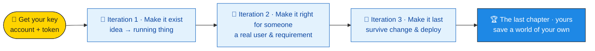

# 🐾 BUILD-AI — Become a Builder


````
### 🌍 You have ideas. Now you can build them.

People have ideas — but most can't build them. **That just changed.**

With low-code blocks and AI, you can turn an idea into a working, useful app —
**no prior coding required**, nothing to install, all in your browser.

### 🎯 What you'll do here

You'll **teach a dog to use AI** to build something genuinely useful: the
**Paws Support Navigator** — a little helper that points dogs and their humans
to the right park, vet, shelter or hotline when they need it.

If Lucky can, so can you.
````
{: .blocks cols="2" }

## 🧩 What "BUILD-AI" means

**BUILD-AI** = **B**usiness-oriented **U**pskilling with **I**ncremental
**L**ow-code **D**elivery and **AI**. In plain words: you learn to *build real
things*, a little at a time, the way modern software teams actually work — with
AI as a power tool, not a magic box.

- ✅ **No prerequisites.** No programming, no maths, no installs.
- ✅ **Browser only.** Everything runs on this page.
- ✅ **3 build sprints + a chapter of your own.** Each one ships something that works.
- ✅ **A credential at the end** — earn karma as you go.

## 🌀 We don't march — we spiral

A lot of courses teach the software lifecycle as a straight line: requirements,
then design, then build, then test, then deploy — eight neat modules, one after
another. That's a *waterfall*, and it's a strange way to teach building *with
AI*, which is anything but linear.

**So we spiral instead.** You travel the *whole* lifecycle — idea → build → test
→ ship — in a short loop, then go around again with higher stakes. Three loops,
two weeks each, then two weeks for a project of your own:



Each loop has an **escalating constraint** — a new "urgent need" that pulls in
exactly the components and concepts you need to clear it. Nothing is taught
"because the syllabus says so"; you meet a tool the moment the project hits a
wall that needs it.

| Weeks | Iteration | The constraint that creates the need | What it pulls in |
|---|---|---|---|
| 1–2 | 🏃 **Make it exist** | idea → a running thing, fast | your key, `.form`, `.diagram`, the build-&-see-it-run loop |
| 3–4 | 🏃 **Make it right for someone** | a *real* user with a *real* requirement | user stories, `.datagrid`, acceptance tests |
| 5–6 | 🏃 **Make it last** | it has to survive change and be deployed | CI/CD, the verification suite, observability |
| 7–8 | 🏆 **The last chapter** (capstone) | *your* world to save — no scaffold | whatever the catalog offers, pulled on demand |

> Notice the shape of this very site: feature cards written as user stories →
> an automated suite that re-checks them on every change → results published as
> living proof. The course teaches the exact loop the medium is built from.
{: .speaker-note }

## 🌙 Inside each loop — we moonwalk

Within every iteration the same three-beat rhythm repeats. We start at the
**goal** — a finished, working thing — then walk *backwards*, peeling back one
layer at a time, until we reach the single idea it grew from. You feel like
you're moving forward the whole time, while the curriculum quietly walks you
back to the foundations.

1. 🐾 **Discover** — use the live thing as a user. *Behavior before architecture.*
2. 🔧 **Design** — open it up: the screen, the model and the code are three views of one thing.
3. 📜 **Specs** — see the promises it keeps (tests), turned into living documentation and reusable blocks.

> This is the *Aristotelian* way: **from the future** — build (and use) the app
> *before* its specs and model. The features were there all along; you just
> discover them last.
{: .speaker-note }

## 🔑 First need: get your key

Iteration 1 opens with the one thing everything else depends on. To **really ask
Ari** for help, and to **ship your own work later**, you need a free GitHub
account and a key (a token). It takes about a minute, and it's the first urgent
need the project hands you — not paperwork, but the thing that switches the
lights on. You use **your own** credits; nothing is billed to anyone else, and
no key ever touches our servers.

[🔑 Get your key → start Iteration 1](/micro_build_ai/onboarding)
{: .lc-btn }

## 📚 The catalog — pulled on demand

The lifecycle topics aren't a fixed track anymore; they're a **catalog of
chapters** you route through as each iteration's needs demand. Every chapter is
modelled as a `KnowledgeNode` (see the [component model](/components/model)) — a
tiny state machine you walk: `discover → design → specify → master`. And the
**[final chapter](/micro_build_ai/capstone) is one you write yourself** — a
world of your own to save.

[📚 Browse the catalog](/micro_build_ai/catalog)
{: .lc-btn }

## 🤖 Meet your guide

Throughout the journey, **Ari** — your Aristotelian guide — is one click away to
rephrase anything, answer "but why?", and nudge you when you're stuck. Ari isn't
a link to somewhere else: it's a **live assistant right on the page**, powered by
your own key. The pet you teach is **Lucky** 🐕 (with **Wanda** 🐠 as the
resident skeptic).

```
### 🔑 Start here
The first need: an account and a key. One minute, then Ari is live.

[Get your key → Iteration 1](/micro_build_ai/onboarding)

### 📚 The catalog
Every lifecycle topic as a chapter, pulled in when you need it.

[Browse the catalog](/micro_build_ai/catalog)

### 🤖 Ask Ari
Your live Aristotelian guide — chat with it right here once you have a key.

[Meet Ari](/micro_build_ai/ari)
```
{: .cards cols="3" }
