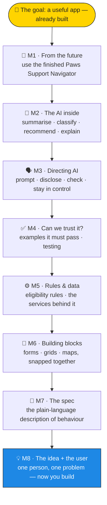

# 🐾 BUILD-AI — Become a Builder

````
### 🌍 AI is reshaping the world. Builders wanted.

People have ideas — but most can't build them. **That just changed.**

With low-code blocks and AI, you can turn an idea into a working, useful app —
**no prior coding required**, nothing to install, all in your browser.

### 🎯 What you'll do here

You'll **teach a dog to use AI** to build something genuinely useful: the
**Paws Support Navigator** — a little helper that points dogs and their humans
to the right park, vet, shelter or hotline when they need it.

If Lucky can, so can you.
````
{: .blocks cols="2" }

## 🧩 What "BUILD-AI" means

**BUILD-AI** = **B**usiness-oriented **U**pskilling with **I**ncremental
**L**ow-code **D**elivery and **AI**. In plain words: you learn to *build real
things*, a little at a time, the way modern software teams actually work — with
AI as a power tool, not a magic box.

- ✅ **No prerequisites.** No programming, no maths, no installs.
- ✅ **Browser only.** Everything runs on this page.
- ✅ **8 short modules.** Each leaves you with something that works.
- ✅ **A credential at the end** — earn karma as you go.

## 🌙 How this works — we moonwalk

Most courses start at the bottom (theory) and climb to a result you might reach
someday. **We do the opposite.** You start at the **goal** — a finished,
working app — then walk *backwards*, peeling back one layer per module, until
you reach the single idea it grew from. You'll feel like you're moving forward
the whole time, while the curriculum quietly walks you back to the foundations.

> This is the *Aristotelian* way: **from the future** — build (and use) the app
> *before* its specs and model. The features were there all along; you just
> discover them last.
{: .speaker-note }

Inside **every** module the same three-beat rhythm repeats:

1. 🐾 **Discover** — use the live thing as a user. *Behavior before architecture.*
2. 🔧 **Design** — open it up: the screen, the model and the code are three views of one thing.
3. 📜 **Specs** — see the promises it keeps (tests), turned into living documentation and reusable blocks.

## 🗺️ The map



## 🤖 Meet your guide

Throughout the journey, **Ari** — your Aristotelian guide — is one click away to
rephrase anything, answer "but why?", and nudge you when you're stuck. The pet
you teach is **Lucky** 🐕 (with **Wanda** 🐠 as the resident skeptic).

```
### ▶️ Start the journey
Module 1 is the big reveal — the finished app, in your hands.

[Begin → M1 · From the future](/micro_build_ai/m1-from-the-future)

### 🧭 How to read a module
Every module follows the same shape, so you always know where you are.

[See the node template](/micro_build_ai/node-template)

### 🏠 Back to the site
[Lightcodepedia home →](/)
```
{: .cards cols="3" }
