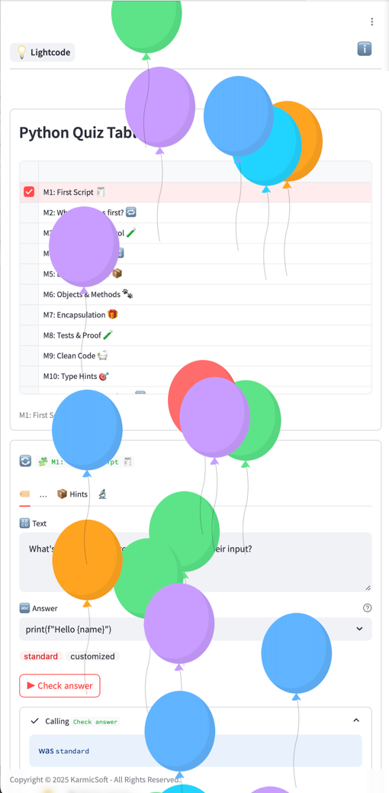

# 👋 Welcome!

👩‍🎓 This tutorial introduces the **building blocks** of a Lightcodepedia page — by showing each one in action.

- [x] **Text** — formatted content, lists, images, video
- [x] **Map** — interactive, zoomable
- [x] **Data table** — sortable rows, linked to a chart
- [x] **Chart** — updates live when you select a row
- [x] **AI assistant** — chat with a guide trained on this site
- [x] **Code runner** — real Python, right in your browser
- [x] **Quiz** — to check what stuck

Go ahead — explore, play, learn and have fun! 🎉

> Tell learners: "Don't just read — every block on this page is live. Click, type, select. That's the whole point."
{: .speaker-note }

---

## 📖 This block is a text block

You are reading a **text block** right now.

A text block can contain:

- [x] **Bold**, _italic_, `code` and [links](/)
- [x] Bullet lists — and checked lists like this one
- [x] Images and videos (see the next two blocks)
- [x] Quotes, tables, and anything else standard markdown supports

Text blocks are the foundation. Every other block sits between them.

_Footer: Text uses standard markdown. [Markdown cheat sheet →](https://www.markdownguide.org/cheat-sheet/)_

---

## 🐕 This block has an image

A text block can carry an image right inside it.



This is a screenshot of **PyQuiz**, a quiz app built entirely with Lightcodepedia components. No server. No framework. Just blocks.

_Footer: Images sit in the `docs/images/` folder of your repo. Reference them with a standard markdown image tag._

---

## 🎥 This block has a video

A text block can embed a video too — paste a YouTube link and add `{: .video }`.

[▶️ Watch: GitHub in 20 minutes](https://www.youtube.com/embed/a9u2yZvsqHA)
{: .video height="320" }

This is how Lightcodepedia handles video — no special player, just an embedded frame.

_Footer: Any YouTube, Vimeo or other embeddable URL works. [Video documentation →](/components/embed_page)_

---

## 🗺️ This block is a map

Click and drag to pan. Scroll to zoom. Click a marker to see its label.

```json
[
  { "lat": 48.85, "lon": 2.35, "label": "Paris 🇫🇷" },
  { "lat": 50.85, "lon": 4.35, "label": "Brussels 🇧🇪" },
  { "lat": 52.37, "lon": 4.90, "label": "Amsterdam 🇳🇱" },
  { "lat": 52.52, "lon": 13.40, "label": "Berlin 🇩🇪" },
  { "lat": 41.90, "lon": 12.50, "label": "Rome 🇮🇹" },
  { "lat": 40.41, "lon": -3.70, "label": "Madrid 🇪🇸" }
]
```
{: .map height="300" zoom="4" }

This is a **map block**. The data is a simple list of coordinates — you write them as a table, the block draws the map.

_Footer: Maps use OpenStreetMap and run entirely in the browser. [Map documentation →](/components/map)_

---

## 📊 This block is a data table

Click any row. Watch what happens to the chart below.

```csv
language,popularity,demand,pay_index,growth
Python,58,80,72,15
JavaScript,62,95,68,8
Java,35,70,75,-5
TypeScript,44,55,78,25
Rust,20,15,82,40
Go,22,22,77,20
Kotlin,16,22,72,18
```
{: .datagrid #tut-grid format="csv" title="Programming languages" height="220" }

This is a **data table** (or datagrid). You paste a CSV table, it becomes a sortable, selectable grid.

_Footer: Data can be inline CSV, a Google Sheet, or a Supabase table. [Datagrid documentation →](/components/datagrid)_

---

## 📈 This block is a chart

It is **linked** to the table above — select a row and this chart redraws.

```csv
language,popularity,demand,pay_index,growth
Python,58,80,72,15
JavaScript,62,95,68,8
Java,35,70,75,-5
TypeScript,44,55,78,25
Rust,20,15,82,40
Go,22,22,77,20
Kotlin,16,22,72,18
```
{: .chart type="bar" bound-to="tut-grid" x="language" height="260" }

> Ask: "Which language has the best pay index? Which is growing fastest?" — let them click to find out.
{: .speaker-note }

_Footer: Charts can be bar, line, pie or doughnut. Link them to a grid with `bound-to`. [Chart documentation →](/components/chart)_

---

## 🤖 This block is an AI assistant

Type a question. Click **Ask**.

```yaml
system: |
  You are a friendly guide for Lightcodepedia.
  Keep answers short (2–3 sentences) and jargon-free.
  When asked about a component, mention that it has a documentation page at /components/.
intro: "Ask me anything about this page, or about Lightcodepedia!"
placeholder: "What is a datagrid?"
```
{: .agent id="tut-agent" }

The first time you use this, a small form will ask for a free access key — a short code from GitHub that takes about a minute to get. The key goes directly to GitHub's AI service. This site never sees it.

_Footer: Each assistant has its own personality, set by a `system:` prompt you write. [Agent documentation →](/components/agent)_

---

## ▶️ This block is a code runner

Click ▶ **Run**. Then edit the code and run it again.

```python
message = "Hello from Lightcodepedia! 👋"
print(message)

for i in range(1, 6):
    print(f"  Step {i} ✅")
```
{: .run }

Real Python, running inside your browser. No install. No server. The code never leaves your machine.

> Ask learners to change the range or the message and run again. They're writing code without knowing it.
{: .speaker-note }

_Footer: The runner uses Pyodide — Python compiled to run in the browser. [Code runner documentation →](/components/run)_

---

## 🧩 Quick check

Now that you've seen everything — let's see what stuck.

**Q:** You clicked a row in the data table and the chart changed. Why?

- [ ] The page sent a request to a server, which recalculated the chart.
- [ ] The page reloaded silently in the background.
- [x] The chart is linked to the table — it listens for row selections and redraws instantly.
- [ ] The chart always shows the same thing — you imagined the change.
{: .quiz }

**Q:** The AI assistant asked you for an access key. What is that key for?

- [ ] To log in to Lightcodepedia — it's your account password.
- [ ] To pay for the AI service — it's billed per question.
- [x] To call GitHub's AI service directly from your browser — the site itself never receives it.
- [ ] Nothing — it's just a formality. Any text works.
{: .quiz }

**Q:** The Python code in the runner — where did it actually execute?

- [x] In your own browser, with no server involved.
- [ ] On Lightcodepedia's servers.
- [ ] On GitHub's computers.
- [ ] It was pre-computed — the output was stored in the page.
{: .quiz }

---

## 🚀 What's next?

You've seen every building block. Ready to add them to your own page?

```
### ⚙️ Step 2 — Build your own page
Make a copy of this site and start adding blocks in minutes. No coding experience needed.

[Start building →](/tutorial102)

### 🧩 Component library
Browse every block type with live examples and full documentation.

[Browse →](/components/)

### 🏠 Back to home
[Home →](/)
```
{: .cards cols="3" }


